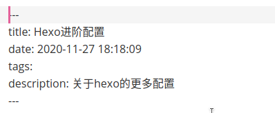

> The only thing that will never change is change.
>
> 永远不变的是改变

# 更改主题

可以到hexo的官方网站https://hexo.io/themes/查看，有很多主题可供选择。这里以安装next主题为例，主题仓库https://github.com/next-theme/hexo-theme-next

## 安装next主题

首先进入到博客的根目录，输入命令

```shell
$ git clone https://github.com/next-theme/hexo-theme-next themes/next
```

## 修改配置

打开`_config.yml`文件，找到`theme:` 这一行，将主题修改为next：

```yml
theme: next
```

## 重新生成网页

```shell
$ hexo g
$ hexo s
```

打开 https://localhost:4000 进行预览

# 显示图片

Hexo自带了这一功能，但需要修改配置文件以启用。打开`_config.yml`文件，找到`post_asset_folder: false`这一行，将`false`改为`true`:

```shell
post_asset_folder: true
```

还需要安装`hexo-asset-link`：

```shell
$ npm install hexo-asset-link
```

配置完成！

之后每次使用`hexo n`创建博文都会在`source/_post/`路径下生成一个和博文title同名的文件夹，将图片放在该文件夹下，在markdown文件中使用相对路径引用图片，编辑完后使用命令`hexo g`生成的静态网页就能正常显示图片了。

# 在主页显示摘要

编辑主题配置文件`theme/next/_config.yml`, 加入`excerpt_discription: true`(next主题默认已经启用了)

在markdown的front-matter中加入`descrption: `，在后面添加摘要，如图：



# 修改显示语言

修改配置文件`_config.yml`，将`language: `后面修改为`zh-CN`。

# END