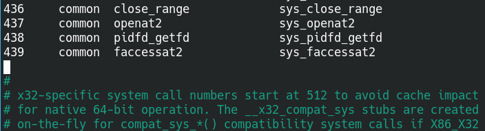
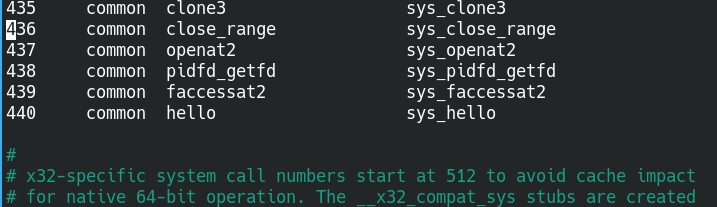
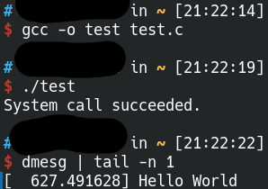

> Hope is a good thing, and no good thing ever dies.
>
> 希望，就如同所有美好的事物一样，永远不会消逝。


## 系统信息

**操作系统:** archlinux-2020.11.01

**架构:** x86_64

**内核版本**: 5.9.10

## 安装过程

 注：为简化过程，全程使用root用户进行

### 准备阶段

安装依赖库

```shell
# pacman -S base-devel xmlto kmod inetutils bc libelf git
```

下载内核源码

```shell
$ wget -P ~/ https://cdn.kernel.org/pub/linux/kernel/v5.x/linux-5.9.10.tar.xz
```

解压并进入解压目录

```shell
# tar -xvf linux-5.9.10.tar.xz -C /usr/src
# cd /usr/src/linux-5.9.10
```

### 添加系统调用

#### 创建系统调用

在解压目录下创建一个文件夹hello，在hello下创建文件hello.c，输入以下内容:

```c
#include <linux/kernel.h>
#include <linux/syscalls.h>

SYSCALL_DEFINE0(hello)
{
    printk("Hello World\n"); // 写入到系统日志
    return 0;
}
```

在hello文件夹下创建Makefile文件，输入以下内容:

```makefile
obj-y := hello.o
```

#### 将该系统调用的目录添加到内核的makefile文件中

打开解压目录下的Makefile文件，找到下面这行

```makefile
core-y		+= kernel/ certs/ mm/ fs/ ipc/ security/ crypto/ block/
```

 在该行末尾添加` /hello`, 添加后如下所示：

```makefile
core-y		+= kernel/ certs/ mm/ fs/ ipc/ security/ crypto/ block/ hello/
```

#### 在系统调用头文件中添加函数的原型

打开`include/linux/syscalls.h` 文件，在文件末尾`#endif`之前添加函数原型，如下：

```c
asmlinkage long sys_hello(void);

#endif
```

#### 将调用添加到内核的系统调用表中

打开`arch/x86/entry/syscalls/syscall_64.tbl`文件，找到下面这一行

```
# x32-specific system call numbers start at 512 to avoid cache impact
```

在该行上方有许多系统调用，如图所示



在编号最大的系统调用也就是439那一行下方添加我们的系统调用，编号为439+1，也就是440，如下图所示：



### 编译内核并安装

#### 内核配置

可以复制系统已有配置：

```shell
# zcat /proc/config.gz > .config
```

也可以手动配置：

```shell
# make menuconfig
```

#### 编译内核

```shell
# make -j$(nproc)  # $(nproc) 表示cpu核的数量
```

#### 安装内核modules

```shell
# make modules_install -j$(nproc)
```

#### 将内核映像拷贝到/boot目录

```shell
# cp -v arch/x86_64/boot/bzImage /boot/vmlinuz-linux59
```

注意：如果是32位系统就要拷贝`arch/x86/boot/bzImage`文件

#### 创建initial RAM disk

注解：initrd用于在Linux系统启动阶段将一个临时的root文件系统加载到内存中，因为此时真正的root还没有挂载。

可以使用系统原有配置进行创建，也可以重新生成。

##### 使用系统原有配置

先复制一份

```shell
# cp /etc/mkinitcpio.d/linux.preset /etc/mkinitcpio.d/linux59.preset
```

再对新副本做一些修改，修改ALL_kver、default_image、fallback_image这三个变量，修改如下：

```shell
...ALL_kver="/boot/vmlinuz-linux59"...default_image="/boot/initramfs-linux59.img"...fallback_image="/boot/initramfs-linux59-fallback.img"
```

生成initramfs image:

```shell
# mkinitcpio -p linux59 # 参数linux59表示使用linux59.preset配置
```

##### 重新生成

```shell
# mkinitcpio -k linux-5.9.10 -g /boot/initramfs-linux59.img
```

#### 复制System.map文件

```shell
# cp System.map /boot/System.map
```

这些步骤完成后`/boot`目录下应该有如下几个文件：

`vmlinuz-linux59`、`initramfs-linux59.img`、`System.map`

#### 重新生成grub.cfg文件

这一步是添加系统启动时的内核入口

```shell
# grub-mkconfig -o /boot/grub/grub.cfg
```

重启之后就能看到我们的新内核了


### 测试系统调用

创建文件`test.c`，内容如下：

```c
#include <linux/kernel.h>
#include <sys/syscall.h>
#include <stdio.h>
#include <unistd.h>
#include <error.h>

#define __NR_hello 440

int main(int argc, char *argv[])
{
    long ret;
    ret = syscall(__NR_hello);
    if (ret < 0)
        perror("System call failed.");
    else
        printf("System call succeeded.");
    return 0;
}
```

编译运行，结果如图：



添加成功!

## 问题记录

### 问题一

编译时报错：.tmp_vmlinux.btf: pahole (pahole) is not available

#### 分析与解决

缺少pahole，安装即可：

```shell
# pacman -S pahole
```

### 问题二

编译时报错：undefined reference to `__x64_sys_hello'

#### 分析与解决

[添加系统调用](#添加系统调用)这一步是参考了这篇博文https://medium.com/anubhav-shrimal/adding-a-hello-world-system-call-to-linux-kernel-dad32875872, 将函数定义写成下面这样

```c
#include <linux/kernel.h>

asmlinkage long sys_hello(void)
{
    printk("Hello world\n");
    return 0;
}
```

根据报错应该将函数名改成`__x64_sys_hello`，也可以使用宏进行定义：

```c
#include <linux/kernel.h>
#include <linux/syscalls.h>

SYSCALL_DEFINE0(hello)
{
    printk("Hello World\n");
    return 0;
}
```

注意：我们在“[在系统调用头文件中添加函数的原型](#在系统调用头文件中添加函数的原型)“这一步中添加的函数名不用改，仍然是`sys_hello`。

### 问题三

在使用带参数的系统调用时，若函数原型不使用SYSCALL_DEFINE宏会出现未定义结果，如：

```c
asmlinkage long sys_add(int a, int b)
{
    return a+b;
}
```

实际调用时得到的返回值是一个无法确定的数。

#### 分析与解决

解决当然就是使用SYSCALL_DEFINE宏进行定义了：

```c
SYSCALL_DEFINE2(add, int, a, int, b)
{
    return a+b;
}
```

分析之后再补充。
