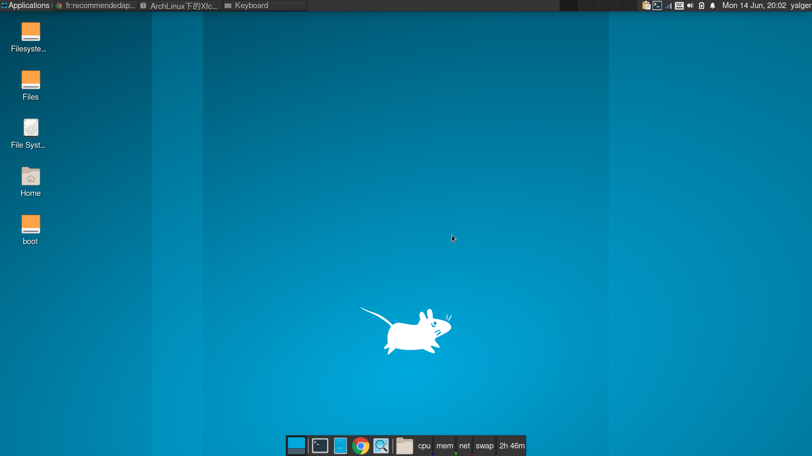

> 路漫漫其修远兮，吾将上下而求索

Xfce是一个基于GTK 3的轻量级模块化桌面，非常简洁，只提供窗口管理器，文件管理器，桌面和应用面板，不过这些都足够提供一个完整的用户体验了。

进入Xfce的桌面环境（如图），下方是一个**居中面板**，有终端模拟器、文件管理器、网页浏览器等启动器；上方是一个**全宽面板**，面板最左边是应用菜单，右边就是一些小**组件**，如网络管理器、扬声器、电源、通知、日期和时间等，小组件的左边是**工作空间**的入口，默认有四个工作空间，我们现在就处在第一个工作空间，可以通过点击这些入口在不同的工作空间之间切换，面板剩余的部分用于存放已经打开的**窗口**。这是一套十分流行的桌面布局，但是图标和窗口就显得有些粗糙。



xfce本身提供了一些非常实用的功能，如xfce4-terminal的下拉终端，xfce4-clipman的剪贴板动作，xfce4-appfinder的自定义动作、xfce4-weather-plugin的天气预报等。

## 下拉终端

Xfce的终端模拟器`xfce4-terminal`默认就支持下拉功能，只需要执行`xfce4-terminal --drop-down`命令就可以打开这样一个下拉终端。为了更方便使用，当然还是要添加到快捷键了。点击右上角的Applications->Settings->Keyboard，在Application Shortcuts标签中添加，命令设置为`xfce4-terminal --drop-down --hide-menubar`，快捷键设置为<em>\<F12></em>（可以根据个人喜好随意设置）。

## 自定义动作

Xfce自带的应用查找工具`xfce4-appfinder`支持自定义动作，自定义动作有两种类型：前缀式和正则式。

前缀式就是通过匹配输入字符串的前缀来指定相应的动作。`xfce4-appfinder`自带的几个实用的动作都是前缀式，其中一个是查询维基百科，前缀是`!w`，相应的指令为`exo-open --launch WebBrowser http://en.wikipedia.org/wiki/%s`（`%s`会被输入字符串中`!w`后面的内容替代）。只要在搜索栏输入`!w xfce`就会打开维基百科的xfce页面。前缀式的设置比较直观，仿照自带的这几个例子很容易就能创建出其他想要的动作。

正则式就是通过正则表达式匹配输入字符串来指定相应的动作。暂时没想到怎么样用，感觉前缀式就足够了。

> 正则表达式如果运用不当，很有可能会使问题变得更复杂。

## 剪贴板动作

`xfce4-clipman`，剪贴板动作可以通过正则表达式匹配剪贴版内容，根据匹配结果弹出可执行的指令供选择。这个动作最大的缺点就是被动触发，复制内容时一旦匹配就会弹窗，即使你不希望它弹出来。

以打开Collins网页查询单词为例。打开Applications->Settings->Clipboard Manager Settings，打开Actions选项卡，点击“+”添加一个action，弹出窗口中，首先给Action命名为“Word Definition”，然后输入要匹配的正则表达式“[a-zA-Z-\s]+”（匹配单词或短语，包括用‘-’连接的组合词），并勾选*Activate only on manual copy*，否则该动作不会生效（见[Actions only work when "Activate on manual copy" is ticked](https://gitlab.xfce.org/panel-plugins/xfce4-clipman-plugin/-/issues/6)）。接着是Command部分，每个action可以有多个Command，每个Command都有一个名称和对应的指令。这里添加一个Command，命名为“Collins Dictionary”， 指令为`exo-open https://www.collinsdictionary.com/dictionary/english/"\0"`，其中“\0”会在指令执行时被所匹配到的内容替代。

> 注意：这里的URL必须用双引号将“\0”包起来，否则如果匹配到的字符串包含换行符，那换行符之后的字符不会被包含在该url中，而是会被当作另一条指令执行，从而导致指令执行时报错：“unable to detect URI-shceme”。或者将指令改成`exo-open --launch WebBrowser https://www.collinsdictionary.com/dictionary/english/\0`就不用双引号了，换行符会被自动替换成一个空格（制表符会被省略）。

## 截图、图片查看和编辑

Xfce内置的截图工具`xfce4-screenshooter`也非常好用，而且系统已经配置好了快捷键，*Print*键全屏截图，*Shift+Print*区域截图，*Alt+Print*截取当前窗口，可以在快捷键设置中进行查看和修改。图片查看和编辑分别用的Ristretto（Xfce项目）和mtPaint，都是非常轻量的应用。

## Synapse

Xfce内置的应用查找仅限于在添加到Applications菜单里的应用，要查找其他应用或者文档就不行了，所以我们需要synapse这个软件，不管是应用、文档还是网页都能检索。首先通过pacman安装synapse

```shell
$ sudo pacman -S synapse
```

将synapse添加到快捷键中，命令设置为`synapse`，快捷键为<em>Alt+\<F2></em>（这个快捷键默认已经分配给了Xfce自带的搜索功能，需要先在快捷键设置中将它删掉或改成其他的）。

> 用了一段时间感觉没多大用，卸了。

## 文档

Xfce自带了一个文本编辑器Mousepad，和gedit简直一模一样，功能也足够了，但界面不好看，也没有扩展。安装一个VScode用于日常开发。PDF阅读器有很多，xreader足矣。Office的话Libreoffice或者WPS都还不错。Markdown用Typora。

```shell
$ sudo pacman -S code xreader libreoffice-fresh   # libreoffice-fresh是稳定版
$ yay -S typora
```

## 中文输入法

安装fcitx5-im（包括fcitx5，fcitx5-configtool，fcitx5-gtk，fcitx5-qt等），fcitx5-chinese-addons。fcitx5-chinese-addons支持云拼音，比fcitx中支持的中文输入法好用太多。

```shell
$ sudo pacman -S fcitx5-im fcitx5-chinese-addons
```

在/etc/environment文件中添加如下内容：

```
GTK_IM_MODULE=fcitx
QT_IM_MODULE=fcitx
XMODIFIERS=@im=fcitx
```

将~/.config/fcitx5/profile修改如下：

```
[Groups/0]
# Group Name
Name=Default
# Layout
Default Layout=us
# Default Input Method
DefaultIM=pinyin

[Groups/0/Items/0]
# Name
Name=keyboard-us
# Layout
Layout=

[Groups/0/Items/1]
# Name
Name=pinyin
# Layout
Layout=

[GroupOrder]
0=Default
```

logout或者重启即可。通过*Ctrl+Space*快捷键切换到拼音输入。

## 其他问题

### 扬声器

安装完Xfce桌面后扬声器用不了，需要安装pavucontrol和pulseaudio这两个包：

```shell
$ sudo pacman -S pavucontrol pulseaudio
```

### 在其他窗口滚动鼠标后，当前窗口失去焦点

Applications->Settings->Window Manager Tweaks->Accessibility，取消勾选Raise windows when any mouse button is pressed。

### 用户家目录没有Documents、Downloads、Pictures等默认文件夹

安装xdg-user-dirs，这是freedesktop标准里的用户家目录管理工具。安装完后执行`xdg-user-dirs-update`命令，重新登录后家目录下就自动生成了这些目录录。在~/.config目录下可以看到两个配置文件：`user-dirs.dirs`和`user-dirs.locale`，前者是相关配置，后者是本地化配置（即语言选项）。

### Thunar没有垃圾桶

安装gvfs（Gnome Virtual File System）。

## End
